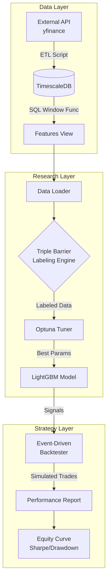
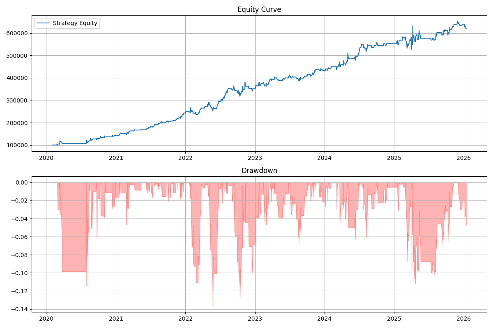

# AlphaBase: Event-Driven Quantitative Research Platform

   

**AlphaBase** 是一個機構級的量化研究與回測系統，專注於解決特徵工程的計算瓶頸與回測中的路徑依賴問題。

本專案整合了 **TimescaleDB** 進行資料庫內運算 (In-Database Computing)，使用 **Triple Barrier Method** 進行嚴謹的數據標註，並結合 **Optuna** 進行貝葉斯超參數優化，最終透過 **Event-Driven Backtester** 模擬真實市場的微觀結構。

---

## 🚀 Core Competencies (核心技術與解決方案)

### 1. High-Performance Data Engineering
* **Infrastructure**: 基於 Docker 部署 **TimescaleDB**，針對金融時序數據 (Time-Series) 進行分區優化。
* **SQL Optimization**: 捨棄 Pandas 迴圈，利用 SQL **Window Functions** 與 **CTEs** 直接在資料庫層計算技術指標 (RSI, Bollinger Bands)，大幅降低 I/O 延遲。

### 2. Advanced Quantitative Methodology
* **Triple Barrier Method (TBM)**: 實作路徑依賴 (Path-Dependent) 的標註法。不同於傳統的「固定時間預測」，TBM 同時考量止盈 (Profit Taking)、止損 (Stop Loss) 與時間到期 (Time Barrier)，更符合真實交易場景。
* **Dynamic Volatility Scaling**: 標註與回測的閾值均基於 EWM (Exponential Weighted Moving Average) 波動率動態調整，適應不同市場狀態。

### 3. Machine Learning Pipeline
* **AutoML with Optuna**: 使用 TPE (Tree-structured Parzen Estimator) 演算法針對 LightGBM 進行貝葉斯超參數優化。
* **Purged Time-Series Validation**: 嚴格的時間序列切分驗證，防止 Look-ahead Bias。

### 4. Event-Driven Backtesting
* **Market Simulation**: 相比於簡單的向量化回測，本系統採用事件驅動架構，能夠模擬日內 (Intraday) 的 High/Low 價格觸發，精確計算滑價與交易成本。

---

## 🛠 System Architecture (系統架構)


## 📊 Backtest Performance (Sample)


Strategy Metrics:

Total Return: 520.77%

Sharpe Ratio: 1.54

Max Drawdown: -13.67%

Profit Factor: 1.46

## 💻 Installation & Usage (安裝與執行)
Prerequisites
- Docker & Docker Compose
- Python 3.8+
1. Setup Environment
啟動 TimescaleDB 容器：
```Bash
git clone https://github.com/yourusername/alphabase.git
cd alphabase
docker-compose up -d
```
2. Install Dependencies
```Bash
pip install -r requirements.txt
```
3. Run Pipeline
Step 1: Data Ingestion (ETL) 從外部 API 下載數據並寫入資料庫：
```Bash
python data_loader.py
```
Step 2: Model Training & Research 執行因子檢驗與 LightGBM 模型訓練：
```Bash
python quant_engine.py
```
Step 3: Backtesting 執行回測並生成績效報告：
```Bash
python backtester.py
```
## 📂 Project Structure
alphabase/
├── data/                   # Docker PostgreSQL data volume
├── assets/
│   └── equity_curve.png
├── src/
│   ├── data_loader.py      # ETL Pipeline & Database Insertion
│   ├── quant_engine.py # Labeling, Optuna Tuning & Training
│   └── backtester.py   # Event-Driven Backtesting
├── docker-compose.yml      # Database Infrastructure
├── requirements.txt        # Python Dependencies
└── README.md               # Documentation
## 📝 Theory: Triple Barrier Method
本專案採用 Marcos López de Prado 提出的標註法。對於每一個觀測點 $t$，我們定義三個邊界：Upper Barrier (Profit Taking): $P_t \cdot (1 + \sigma_t \cdot M_{pt})$Lower Barrier (Stop Loss): $P_t \cdot (1 - \sigma_t \cdot M_{sl})$Vertical Barrier (Time): $t + \text{days}$標籤 $Y_i$ 根據價格路徑 $P_{t \to T}$ 首先觸碰到的邊界決定：$$Y_i = \begin{cases} 
1 & \text{if touches Upper Barrier first} \\
-1 & \text{if touches Lower Barrier first} \\
0 & \text{if touches Vertical Barrier}
\end{cases}$$
## 📬 Contact
- Author: Willy Tsai
- Email: Willy100693@gmail.com
- LinkedIn: www.linkedin.com/in/維宸-蔡-812275214